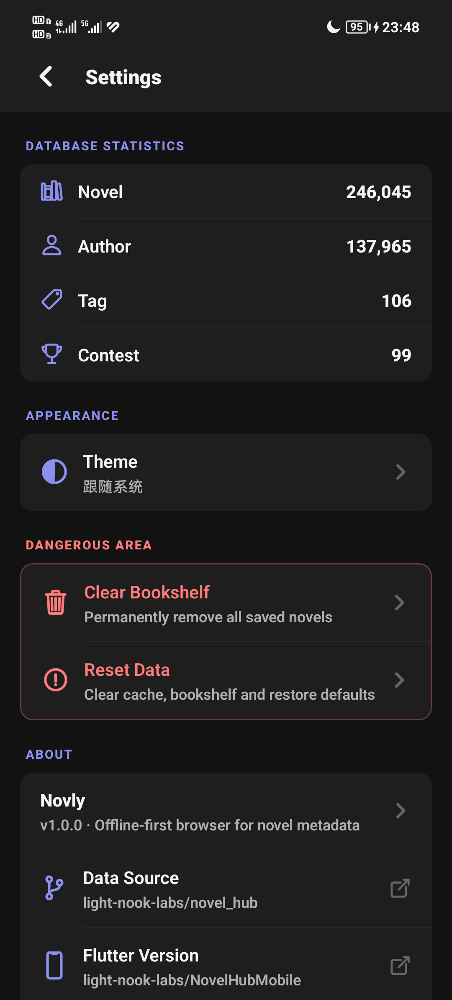
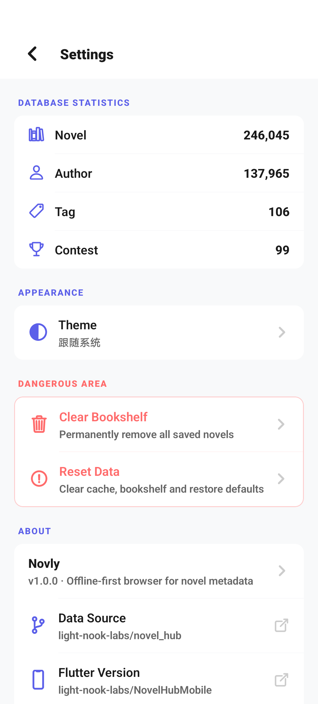
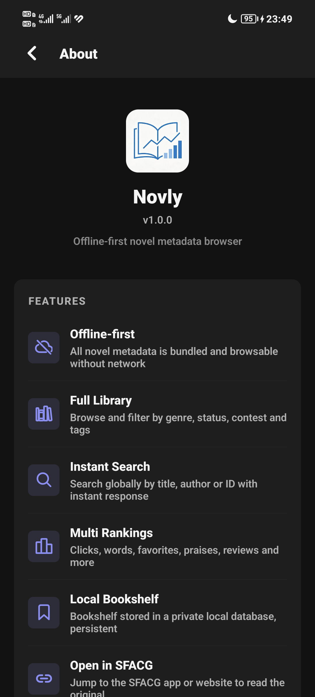
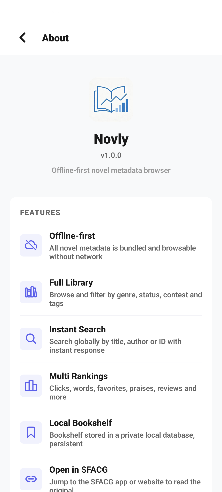
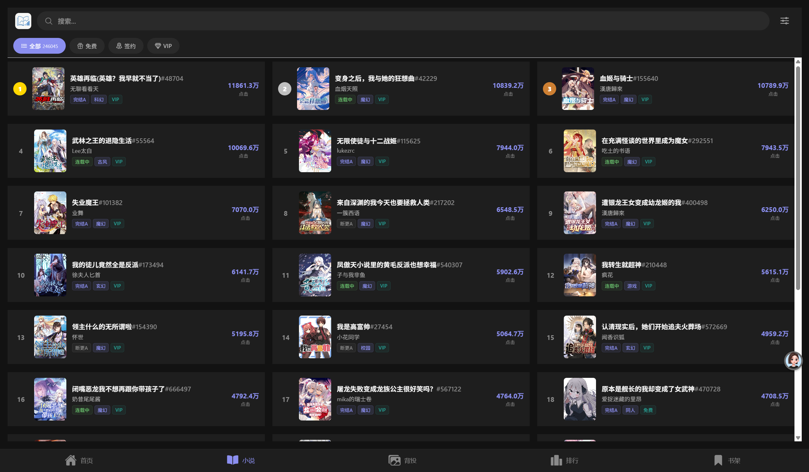

# Novly

> 离线优先的小说元数据浏览器 — React Native / Expo 实现

> **🌐 语言切换**:简体中文 | [English](./README_EN.md)

Novly 是一个离线优先的轻小说元数据浏览应用：数据打包内置（SQLite），无网络也能浏览全部小说元数据（分类、状态、赛事、标签、排行、作者等），并支持一键跳转 SFACG 阅读原文。

**数据来源**：[light-nook-labs/novel_hub](https://github.com/light-nook-labs/novel_hub)（上游数据仓库，`assets/seed.sql.gz` 由其上流数据生成）

**姊妹项目**：[NovelHubMobile (Flutter 版)](https://github.com/light-nook-labs/NovelHubMobile)

## 功能特性

- 📦 **离线优先**：小说元数据打包内置（`seed.sql.gz` → SQLite），完全离线可用
- 🏷️ **全库浏览**：按分类、状态、赛事、标签多维度浏览与筛选，支持 ptype（免费/签约/VIP）过滤
- 🔍 **快速搜索**：按标题、作者、小说 ID 全局搜索，输入即搜、无限滚动
- 🏆 **多维排行**：点击、字数、收藏、点赞、长评、短评六维榜单
- 🔖 **本地书架**：书架数据独立存储于本地数据库（`bookshelf.sqlite`），用户私有数据，全局数据重置不影响
- 🌗 **SFACG 跳转**：在 App / 浏览器中打开原文，支持 Web 端分享 SFACG 链接
- 🎨 **主题切换**：跟随系统 / 浅色 / 深色三种配色方案，全页面即时响应
- 🖼️ **背投图库**：小说背投（banner）图片浏览与全屏预览
- 📚 **在线书单**：浏览 SFACG 书单（需网络），支持 ID 搜索自行探索书单与作品
- 🌐 **跨平台**：Web / Android / iOS

## 界面预览

> 以下截图展示了 Novly 的核心功能:首页轮播与导航、背投图库、多维排行、小说详情、主题切换(深/浅色)与关于页。

| 页面     | 深色模式                                           | 浅色模式                                                 |
| -------- | -------------------------------------------------- | -------------------------------------------------------- |
| 首页     |      |      |
| 背投     |   |   |
| 排行     |      |      |
| 小说详情 |    |    |
| 设置     |  |  |
| 关于     |     |     |

### PC 桌面版

> 桌面应用(Tauri v2)在宽屏下的界面效果(多列网格布局)。

| 页面     | 预览                                                 |
| -------- | ---------------------------------------------------- |
| 首页     |     |
| 小说列表 |   |
| 背投     |  |

## 技术栈

| 类别   | 技术                                                                                             |
| ------ | ------------------------------------------------------------------------------------------------ |
| 框架   | [React Native](https://reactnative.dev) + [Expo SDK 57](https://docs.expo.dev/versions/v57.0.0/) |
| 路由   | expo-router                                                                                      |
| 语言   | TypeScript                                                                                       |
| 数据库 | expo-sqlite（全局数据 + 书架本地库）                                                             |
| 持久化 | AsyncStorage（主题偏好、列表缓存）                                                               |
| 包管理 | pnpm                                                                                             |

## 桌面应用(Windows)

Novly 支持打包为 Windows 桌面应用(Tauri v2),与 Web 版同源,离线优先。

### 构建

```bash
pnpm tauri build
```

产物:`src-tauri/target/release/bundle/nsis/Novly_1.1.0a_x64-setup.exe`

### 安装行为

- 安装时可自定义安装目录
- 默认目录:`D:\novly`(无 D 盘时回退 `C:\Program Files\Novly`)
- 自动创建目录,内置卸载程序

## 快速开始

```bash
# 1. 安装依赖
pnpm install

# 2. 启动开发服务（选择平台）
pnpm start          # 交互式选择
pnpm run web        # Web
pnpm run android    # Android
pnpm run ios        # iOS
```

首次启动会自动解压 `assets/seed.sql.gz` 并初始化数据库。

> ⚠️ **Expo SDK 已更新**：写代码前务必查阅 [Expo v57 文档](https://docs.expo.dev/versions/v57.0.0/)，不要依赖旧版 API 的记忆。

## 项目结构

```
novim/
├── app/                      # expo-router 路由（页面）
│   ├── (tabs)/               # 底部 tab：首页/小说/背投/排行/书架
│   │   ├── index.tsx         #   首页（banner + 导航网格 + 完本推荐/萌神大赛 + 书单入口）
│   │   ├── novels.tsx        #   小说列表（搜索 + 筛选面板）
│   │   ├── banners.tsx       #   背投图库
│   │   ├── rankings.tsx      #   多维排行
│   │   └── bookshelf.tsx     #   书架（grid 布局）
│   ├── novel/[id].tsx        # 小说详情（分享/书架/跳转 SFACG）
│   ├── author/[id].tsx       # 作者详情
│   ├── tag/[id].tsx          # 标签详情
│   ├── contest/[id].tsx      # 赛事详情
│   ├── genre/[id].tsx        # 分类详情
│   ├── status/[id].tsx       # 状态详情
│   ├── authors.tsx           # 作者列表
│   ├── tags.tsx              # 标签列表
│   ├── contests.tsx          # 赛事列表
│   ├── genres.tsx            # 分类列表
│   ├── statuses.tsx          # 状态列表
│   ├── booklists.tsx         # 书单列表（在线拉取，ID 搜索）
│   ├── booklists/[id].tsx    # 书单详情（书单信息 + 小说列表）
│   ├── search.tsx            # 全局搜索
│   ├── search/banners.tsx    # 背投搜索
│   └── settings.tsx          # 设置（主题切换/危险操作/关于）
├── components/               # 公共组件
│   ├── ThemeProvider.tsx     #   主题系统（system/light/dark）
│   ├── Header.tsx            #   PageHeader（返回/搜索/右侧按钮）
│   ├── TabHeader.tsx         #   tab 页头（logo + 搜索 + 右侧）
│   ├── NovelRow.tsx          #   小说行（封面 + 徽章 + 排行）
│   ├── Banner*.tsx           #   轮播/背投组件
│   ├── NovelFilterSheet.tsx  #   筛选弹窗
│   ├── InfoSheet.tsx         #   底部说明弹层（Why Novly 等）
│   ├── ConfirmDialog.tsx     #   危险操作确认框
│   ├── AppInfoSheet.tsx      #   关于信息弹窗
│   └── ...
├── hooks/                    # 自定义 hooks（useNovels、useScrollToTop）
├── utils/                    # 工具层
│   ├── database.ts           #   全局数据库（初始化/seed 解压）
│   ├── bookshelfDb.ts        #   书架本地数据库
│   ├── mappings.ts           #   分类/状态/ptype 映射与格式化
│   └── urls.ts               #   封面/背投 URL 生成
├── constants/theme.ts        # 配色方案（light/dark）+ 尺寸常量
└── assets/                   # 图标、seed.sql.gz
```

## 二次开发

详细开发指南见 **[AGENTS.md](./AGENTS.md)**（英文），包含：

- 主题化改造模式（`useTheme` + 组件内 `useMemo` 动态样式 / `createStyles(colors)`）
- 数据层约定（全局库 vs 书架本地库、分页、状态归并）
- 已踩过的坑与已修复的 bug（防止回归）
- 关键文件速查

## 贡献指南

- 发现 bug 或有改进建议，请提交 [Issue](https://github.com/light-nook-labs/novly/issues)
- 欢迎提交 [Pull Request](https://github.com/light-nook-labs/novly/pulls)：先 fork → 新建分支 → 提交 → PR
- 提交前请运行 `npx tsc --noEmit` 确保类型检查通过

## 许可证

[MIT](./LICENSE) © light-nook-labs

---

_本项目的开发得到了 OpenCode & AtomCode AI 辅助。_
